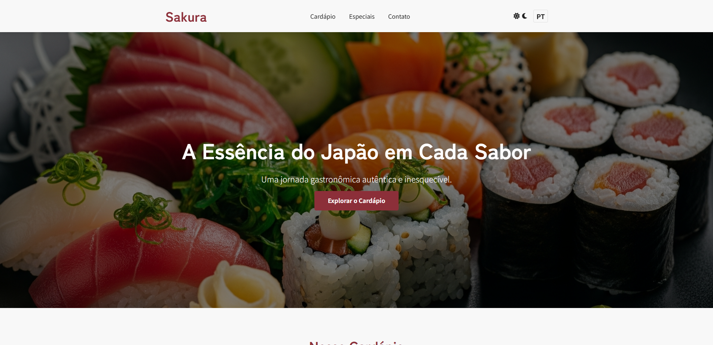
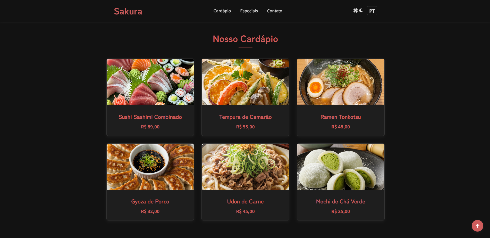

# ✨ Sakura: Culinária Japonesa ✨

### 🍣 Uma Experiência Digital Completa para um Restaurante Autêntico

Este projeto é um site de front-end moderno e elegante, simulando a presença digital de um restaurante de culinária japonesa. Ele combina um design responsivo com funcionalidades interativas e acessíveis, proporcionando uma jornada gastronômica digital memorável.

## 🖥️ Demonstração Visual

Explore a versatilidade do tema com uma prévia da interface nos modos claro e escuro.


_Visão do site no modo claro, destacando a seção de herói e o cardápio._


_Visão do site no modo escuro, com destaque para a seção de especiais e o formulário de contato._

## 🌟 Funcionalidades em Destaque

- **Alternância de Tema (Modo Claro/Escuro):** Permite que o usuário personalize a navegação. A preferência de tema é salva no `localStorage`, mantendo a escolha em futuras visitas.
- **Suporte a Múltiplos Idiomas (i18n):** Tradução instantânea entre Português e Inglês, com o idioma preferido salvo no `localStorage`, garantindo acessibilidade a um público global.
- **Cardápio Dinâmico e Interativo:** Navegue pelo cardápio com um design de grid atraente. Ao clicar em um prato, um modal elegante é exibido com a descrição e os ingredientes completos, traduzidos para o idioma atual.
- **Carrossel de Especiais:** Uma galeria de imagens para seduzir os visitantes com os pratos mais especiais da casa, com navegação fluida por botões.
- **Formulário de Reserva Inteligente:** Um formulário de contato simples e prático, que valida os dados em tempo real e exibe uma notificação de sucesso (`Toast`) após o envio.
- **Navegação Aprimorada:** O botão "Voltar ao Topo" aparece ao rolar a página para baixo, facilitando a movimentação e proporcionando uma navegação mais fluida em páginas longas.
- **Design Responsivo:** Uma experiência impecável em qualquer dispositivo, do desktop ao smartphone, graças ao uso de **Flexbox** e **Grid**.

## 💻 Tecnologias Utilizadas

Este projeto é 100% **Front-end**, construído com as seguintes tecnologias, sem a necessidade de dependências ou back-end:

- **HTML5:** Estrutura semântica e acessível, servindo como a base sólida do projeto.
- **CSS3:** Estilização moderna com **CSS Variables** para o sistema de temas, e **Flexbox** e **Grid** para o layout responsivo.
- **JavaScript (ES6+):** A alma interativa do projeto, responsável por todas as funcionalidades dinâmicas, como o modal, a alternância de idioma, o carrossel e a validação do formulário.
- **Fontes e Ícones:** Utilização do Google Fonts (`Playfair Display`, `Poppins`) e ícones em **SVG** para um design de alta qualidade e leveza.

## 🚀 Como Executar o Projeto

1.  **Clone o repositório:**
    ```bash
    git clone [https://github.com/VitorPaiola/seu-repositorio.git](https://github.com/VitorPaiola/seu-repositorio.git)
    ```
2.  **Navegue até a pasta do projeto:**
    ```bash
    cd seu-repositorio
    ```
3.  **Abra o arquivo `index.html`:**
    Simplesmente arraste o arquivo `index.html` para o seu navegador ou use a extensão "Live Server" do VS Code.

## 📁 Estrutura do Projeto

```estrutura
├── images/
│   ├── gyoza.png
│   ├── mochi.png
│   ├── ramen.png
│   ├── sushi-sashimi.png
│   ├── tempura.png
│   ├── udon.png
│   └── (outras imagens de demonstração)
├── index.html
├── script.js
└── styles.css
```

---

## 📜 Licença

Este projeto é de código aberto e está licenciado sob os termos da [Licença MIT](https://opensource.org/licenses/MIT). Sinta-se à vontade para usar e adaptar o código conforme necessário.

## 🤝 Contribuições

Contribuições são sempre bem-vindas! Se você tem sugestões de melhorias ou encontrou algum problema, sinta-se à vontade para:
1.  Fazer um **Fork** do projeto.
2.  Criar uma nova **Branch** (`git checkout -b feature/SuaSugestao`).
3.  Fazer suas alterações e **Commitar** (`git commit -m 'feat: Adiciona sua sugestao'`).
4.  Subir para a sua branch (`git push origin feature/SuaSugestao`).
5.  Abrir um **Pull Request**.

Estou ansioso para ver suas melhorias! 😃

---

<p align="center">Feito com ❤️ por <a href="https://github.com/VitorPaiola">Vitor Paiola</a></p>
